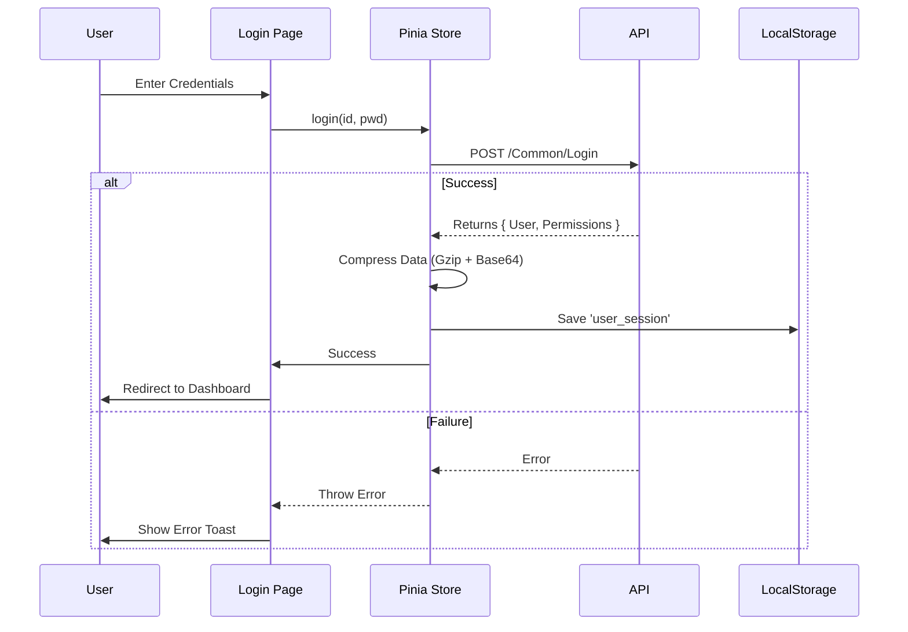
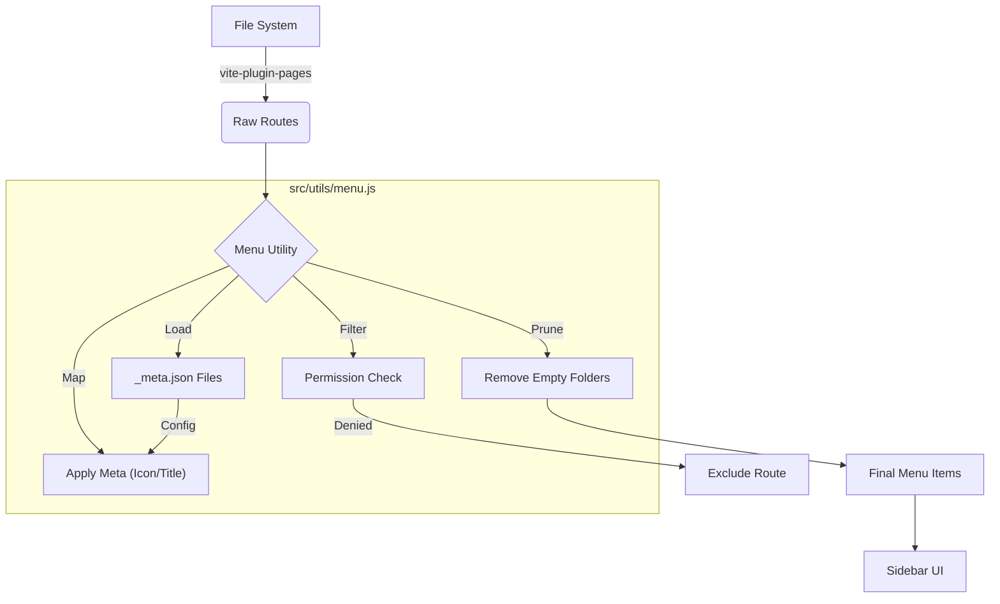
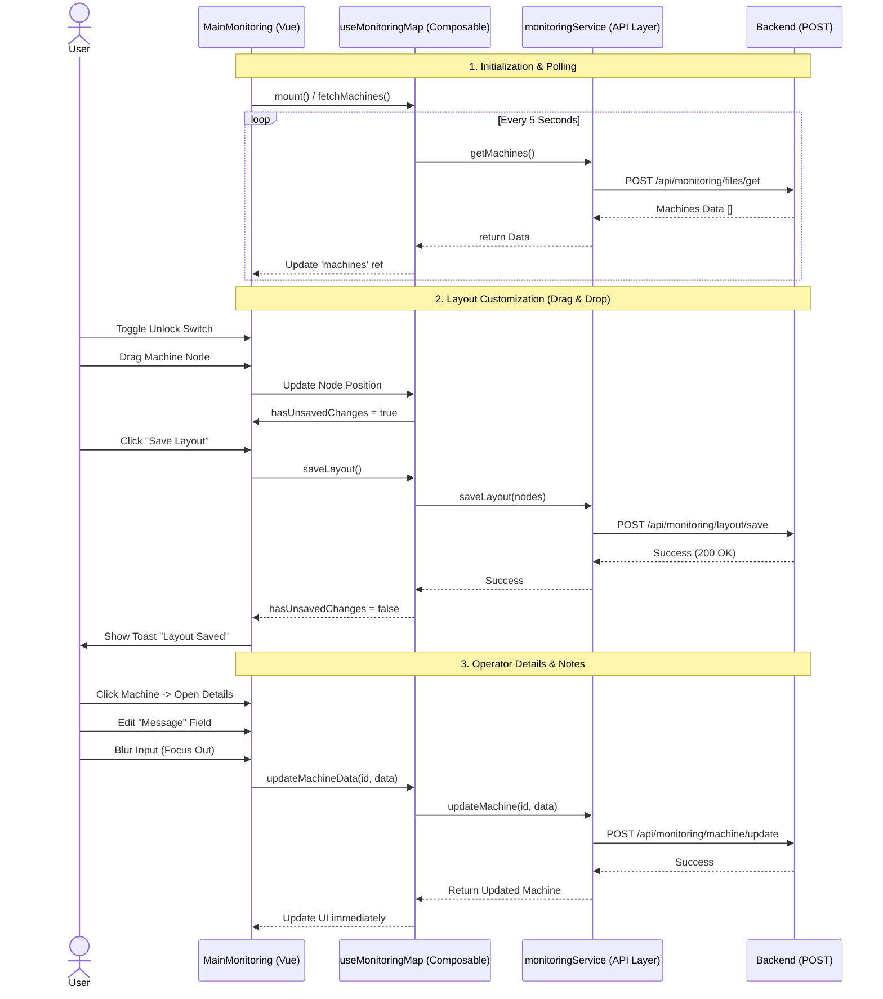

# Vue 3 Enterprise Dashboard Template

A robust, scalable, and high-performance dashboard template built with Vue 3, Vite, and PrimeVue. Features advanced Authentication, Role-Based Access Control (RBAC), and a Data-Driven Sidebar Menu system.

## 🚀 Key Features

-   **⚡ High Performance**: Powered by **Vite** with optimized chunk splitting (`manualChunks`).
-   **🔐 Secure Authentication**:
    -   Real API integration.
    -   Client-side data security using **Gzip + Base64** encoding for LocalStorage.
    -   Automatic session management and logout confirmation.
-   **🛡️ Role-Based Access Control (RBAC)**:
    -   Route-level permission guards (`meta: { permission: [...] }`).
    -   Automatic redirection to `403 Access Denied` for unauthorized users.
    -   Smart menu filtering (hides unauthorized links automatically).
-   **📂 Data-Driven Sidebar**:
    -   **Zero-Config Routing**: Uses `vite-plugin-pages` for file-system based routing.
    -   **Modular Configuration**: Control folder labels and icons via local `_meta.json` files.
    -   **Smart Pruning**: Recursively removes empty folders if users lack permissions for all children.
-   **🎨 Modern UI/UX**:
    -   **PrimeVue** Component Suite (Unstyled mode with Tailwind CSS).
    -   **Dark Mode** support (System default + Toggle).
    -   **Responsive Layout** with a refined "Smart Toggle" sidebar.

## 🛠️ Technology Stack

| Category | Technology | Description |
| :--- | :--- | :--- |
| **Framework** | [Vue 3](https://vuejs.org/) | Composition API + `<script setup>` |
| **Build Tool** | [Vite](https://vitejs.dev/) | Super fast build and HMR |
| **Routing** | [Vue Router](https://router.vuejs.org/) | With `vite-plugin-pages` for file-system routing |
| **State Management** | [Pinia](https://pinia.vuejs.org/) | Type-safe, intuitive stores |
| **UI Components** | [PrimeVue](https://primevue.org/) | Enterprise-class UI components |
| **Styling** | [Tailwind CSS](https://tailwindcss.com/) | Utility-first CSS framework |
| **Utilities** | [Pako](https://github.com/nodeca/pako) | Zlib port for Gzip compression |
| **Charts** | [Chart.js](https://www.chartjs.org/) | Data visualization (via `vue-chartjs`) |

## 📐 Architecture & Workflows

### 1. Authentication Flow
Secure login process with client-side encryption for storage.



### 2. Menu Generation System
How the sidebar menu is built dynamically from files.




## 📂 Project Structure

```text
src/
├── components/          # Global reusable components (Buttons, Cards)
├── composables/         # Reusable stateful logic (Vue Hooks)
├── layouts/             # Layout templates (default.vue)
├── pages/               # File-system routes
│   ├──     /       # Feature Folder
│   │   ├── _meta.json   # Folder Configuration
│   │   └── Overview.vue # Page
│   ├── System/          # System Pages (Login, 403)
│   │   ├── _meta.json   # Hidden: true
│   │   └── Login.vue
│   └── ...
├── services/            # API services and external integrations
├── stores/              # Global State Management (Pinia)
├── utils/               # Pure helper functions (formatters, parsers)
├── App.vue              # Main App entry
└── main.js              # Bootstrapper
vite.config.js           # Build config (Manual Chunks)
```

## 🧠 Code Organization Guide

Where should your code go? Follow these best practices:

| Logic Type | Recommended Folder | Example |
| :--- | :--- | :--- |
| **API Calls** | `src/services/` | `authService.js`, `userService.js` |
| **Global State** | `src/stores/` | `useAuthStore` (User session, Permissions) |
| **Reusable Logic** | `src/composables/` | `useToggle`, `useFetch`, `useWindowSize` |
| **Helper Functions** | `src/utils/` | `dateFormatter.js`, `mathUtils.js` |
| **UI Components** | `src/components/` | `CustomButton.vue`, `UserCard.vue` |

### 📂 Feature Folder Mirroring (Recommended)

To keep large projects organized, mirror the `src/pages` structure inside `services`, `composables`, and `components`.

**Example:**
If you have a page:
`src/pages/Analytics/Overview.vue`

You should create:
-   `src/services/Analytics/analyticsService.js` (API)
-   `src/composables/Analytics/useAnalytics.js` (Logic)
-   `src/components/Analytics/StatCard.vue` (UI)

This keeps everything related to "Analytics" easy to find! 🔍

## ⚙️ Configuration

### Folder Metadata (`_meta.json`)
To customize a folder in the sidebar, create a `_meta.json` file inside it:

```json
// src/pages/YourFolder/_meta.json
{
  "title": "Custom Label",
  "icon": "pi pi-star",
  "hidden": false
}
```

### Route Permissions
Control access to specific pages using the `<route>` block in Vue files:

```vue
<route>
{
  meta: {
    title: "Secure Page",
    permission: ["ADMIN", "MANAGER"] // User needs AT LEAST one of these
  }
}
</route>
```

## 📦 Installation & Setup

```bash
# 1. Install Vue dependencies
npm install

# 2. Install backend dependencies
cd backend
python -m venv .venv
.venv\Scripts\activate
pip install -r requirements.txt
cd ..

# 3. Run backend server
cd backend
.venv\Scripts\activate
uvicorn main:app --reload --host 127.0.0.1 --port 8000

# 4. Run frontend server
cd ..
npm run dev

# 5. Build for Production
npm run build
```

## 🚢 Deployment Optimization

The `vite.config.js` is pre-configured with **Manual Chunk Splitting** to ensure optimal cache performance:

*   `vendor.js`: Core libraries (Vue, Router, Pinia)
*   `primevue.js`: UI Library
*   `chart.js`: Visualization Library
*   `pako.js`: Compression Utility

This prevents the "large bundle" warning and speeds up subsequent page loads.
 
## 🧩 Module Logic Documentation
This section documents the specific business logic and API requirements for independent feature modules.

### 1. Equipment Monitoring Map (src/pages/Monitoring)

The **Equipment Monitoring Map** is a visual tool to track machine status in real-time using ue-flow.

**Key Logic:**
*   **Drag Constraints**: Machines can only be moved when the map is explicitly **Unlocked** by an Admin.
*   **Persistence Strategy**: 
    1.  Positions are only saved when the user clicks 'Save Layout'.
    2.  Operator messages are auto-saved on blur.
    3.  A 'Reset' action discards unsaved changes and re-fetches the last server state.
*   **Polling**: The map automatically polls for status updates (every 5s) to reflect live data from the factory floor without refreshing.

**API Specification (POST Only):**

| Action | Method | Endpoint | Description |
| :--- | :--- | :--- | :--- |
| **List Machines** | POST | /api/monitoring/files/get | Returns list of machines with position and data. |
| **Save Layout** | POST | /api/monitoring/layout/save | Receives array of {id, position} updates. |
| **Update Note** | POST | /api/monitoring/machine/update | Receives {id, data: {message}}. |

*For implementation details, see src/services/Monitoring/monitoringService.js.*

**Logic Flow Diagram:**


