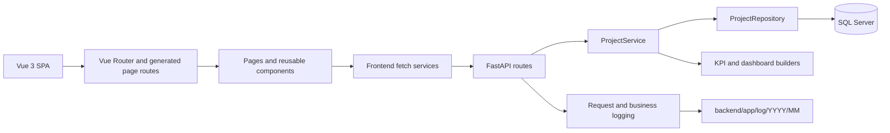
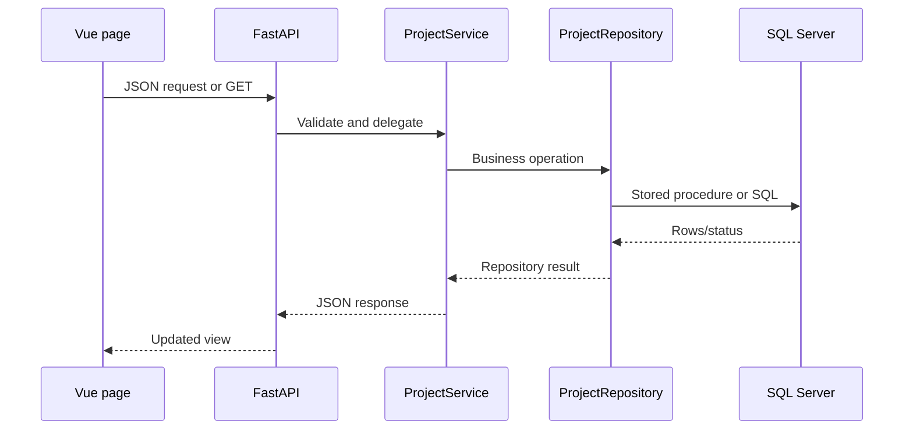

# Project Management System

Internal project-management dashboard for creating projects, maintaining project task rows, reviewing project status, and viewing KPI and dashboard summaries. It is a Vue 3 single-page application backed by FastAPI and SQL Server.

This document describes the implementation currently present in the repository and labels operational gaps explicitly.

## System Overview

- Create projects with main tasks and newline-separated subtasks.
- Display project data as grouped project, task, and full-detail views.
- Edit, insert, and delete project item rows.
- Calculate project status summaries from plan and actual dates.
- Provide personal KPI, department KPI, dashboard summary, and missing-assignee views.
- Authenticate users through the backend login procedure and apply permission checks in the frontend router/menu.

The repository does not contain a product specification defining target ownership or production service-level requirements. `TODO: Verify this behavior.`

## Architecture


```mermaid
flowchart LR
    Browser[Vue 3 SPA] --> Router[Vue Router and generated page routes]
    Router --> Pages[Pages and reusable components]
    Pages --> Services[Frontend fetch services]
    Services --> API[FastAPI routes]
    API --> Service[ProjectService]
    Service --> Repository[ProjectRepository]
    Repository --> SQL[(SQL Server)]
    Service --> Builders[KPI and dashboard builders]
    API --> Logging[Request and business logging]
    Logging --> LogFiles[backend/app/log/YYYY/MM]
```

| Layer | Location | Responsibility |
| --- | --- | --- |
| Frontend bootstrap | [src/main.js](src/main.js) | Creates Vue app; registers Pinia, Router, PrimeVue, and the EnCo API client. |
| Routing | [src/router.js](src/router.js) and `src/pages/` | Uses generated routes/layouts; redirects unauthenticated users and checks permission metadata. |
| Frontend UI | `src/pages/`, `src/components/`, `src/layouts/` | Project editing, dashboards, KPI, monitoring, settings, and error pages. |
| Frontend API wrapper | [src/services/projectService.js](src/services/projectService.js) | Calls FastAPI endpoints with `fetch`. |
| API | [backend/app/api/routes/project_routes.py](backend/app/api/routes/project_routes.py) | Validates request models and delegates to the service. |
| Service | [backend/app/services/project_service.py](backend/app/services/project_service.py) | Applies business orchestration, status calculations, authentication, and transformations. |
| Repository | [backend/app/repositories/project_repository.py](backend/app/repositories/project_repository.py) | Executes stored procedures and direct SQL against SQL Server. |
| Database | [backend/app/core/database.py](backend/app/core/database.py) | Creates per-request `pyodbc` connections using ODBC Driver 18. |

Each request obtains a connection through [backend/app/api/dependencies.py](backend/app/api/dependencies.py), creates a repository/service pair, and closes the connection afterward. Middleware logs method, path, status, duration, client IP, and inferred user ID.

## Project Structure

```text
src/
  main.js                         Vue bootstrap and global plugins
  router.js                       Generated routes and navigation guard
  pages/                          Route components and <route> metadata
    01_ProjectMgm/                Project creation and project item grid
    02_KpiSytem/                  Personal and department KPI pages
    Analytics/                    Analytics page
    Monitoring/                   Machine monitoring page
    System/                       Login and error pages
    index.vue                     Dashboard with live/demo data switch
  components/                     Reusable UI and dashboard components
  services/                       Frontend API clients
  stores/auth.js                  Pinia authentication and permission state
  layouts/                        Authentication and default layouts
  composables/                    Shared Composition API logic
  styles/                         Global styles
backend/
  main.py                         Thin Uvicorn import target
  config.ini                      Local database configuration
  requirements.txt                Python dependencies
  app/main.py                     FastAPI app, CORS, router, middleware
  app/config.py                   Config-file and environment loading
  app/api/                        Dependencies and API routes
  app/models/schemas.py           Pydantic request models
  app/core/                       Database, middleware, exceptions
  app/repositories/               SQL Server access
  app/services/                   Business orchestration and builders
  app/utils/security.py           Password transformation helpers
  app/log/                        Date-partitioned logs
package.json                      Frontend dependencies and scripts
vite.config.js                    Vite, generated pages/layouts, chunking
```

Add API contracts to `backend/app/models/schemas.py`, handlers to the route module, business behavior to a service, and database calls to the repository. Add screens under `src/pages/` so `vite-plugin-pages` generates their routes.

## Main Process Flows

### Project creation

1. `ProjectCreation.vue` validates project number, name, at least one item, each main task, and each budget.
2. It sends `general`, `items`, and `userId` to `POST /projects`.
3. `ProjectService` checks duplicate main tasks through `USP_DS_Check_Duplicate_Task`.
4. The repository calls `USP_PM_Create_Project`.
5. Newline-separated `subtasks` are split into ordered detail rows.
6. Detail rows are inserted into `DS_PM_Item` using `executemany`.
7. Creation and insertion events are written to the daily log.

### Project item maintenance

1. `project_info.vue` loads `/projects/details` and constructs grouped header/detail rows for Handsontable.
2. The grid supports project, task, and full-detail modes, plus project/task/assignee searches.
3. Edits, inserted rows, and deleted rows are tracked separately.
4. Save processes deletes, inserts, then bulk updates.
5. The backend performs the operations and the page reloads the complete dataset.

The frontend warns at 500 deleted rows but the current code does not submit that batch. The intended limit and server behavior are `TODO: Verify this behavior.`

### Project status summary

`GET /projects/summary` groups rows by project, uses the earliest plan/actual start and latest plan/actual end, and assigns:

| Condition | Status |
| --- | --- |
| No plan start and end | `No plan` |
| No actual start and end | `Not yet start` |
| Actual start without actual end | `On going` |
| Actual end after plan end | `Delay` |
| Actual end before plan end | `Ahead of schedule` |
| Other completed actual end | `On Time` |

`completed_projects` includes ahead-of-schedule, on-time, and delayed projects.

### Dashboard and KPI

The backend loads raw rows from SQL Server and transforms them with `PersonalKPIBuilder`, `DeptKPIBuilder`, and `DashboardBuilder`. The dashboard supports an explicit demo dataset and falls back to local demo data when live loading fails. Demo metrics are not production data.

## Data Flow and API Surface


```mermaid
sequenceDiagram
    participant UI as Vue page
    participant API as FastAPI
    participant S as ProjectService
    participant R as ProjectRepository
    participant DB as SQL Server
    UI->>API: JSON request or GET
    API->>S: Validate and delegate
    S->>R: Business operation
    R->>DB: Stored procedure or SQL
    DB-->>R: Rows/status
    R-->>S: Repository result
    S-->>API: JSON response
    API-->>UI: Updated view
```

There is no common API prefix. Endpoints are:

| Method | Path | Request/result |
| --- | --- | --- |
| GET | `/health` | Returns `{ "status": "ok" }`. |
| GET | `/testconnection` | Runs the project detail query and reports connection status. |
| POST | `/projects` | `ProjectPayload` (`general`, `items`, `userId`); creates project and details. |
| GET | `/projects/details` | Project detail rows. Frontend `userId` query is currently ignored. |
| GET | `/projects/summary` | Calculated project status counts. Frontend `userId` query is currently ignored. |
| POST | `/project-items/delete` | `{ item_ids: string, user_id: string }`; stored-procedure delete. |
| POST | `/project-items/insert` | Array of `InsertRowRequest`; per-row insert statuses. |
| PUT | `/project-items/bulk-update` | Array of `ProjectItemUpdate`; updates by `item_id`. |
| POST | `/Common/Login` | `{ ldapName, userId, password }`; returns user and permission codes. |
| POST | `/changeuserpw` | `{ userId, currentPassword, newPassword }`. |
| GET | `/kpi/personal` | Personal summary, detail, and raw KPI data. |
| GET | `/kpi/dept` | Department KPI summary and detail. |
| GET | `/dashboard/summary` | Dashboard aggregation. |
| GET | `/dashboard/itemmissing` | Rows with missing data. |

Full request fields are defined in [backend/app/models/schemas.py](backend/app/models/schemas.py), which is the contract source of truth.

## Configuration

Database settings are loaded by [backend/app/config.py](backend/app/config.py). Environment variables override `[DATABASE]` in `backend/config.ini`:

| Variable | Meaning | Default |
| --- | --- | --- |
| `DB_SERVER` | SQL Server host | `localhost` |
| `DB_NAME` | Database name | `master` |
| `DB_USERNAME` | Database user | Empty |
| `DB_PASSWORD` | Database password | Empty |
| `DB_PORT` | SQL Server port | `1433` |

The connection uses ODBC Driver 18 with `Encrypt=no` and `TrustServerCertificate=yes`. Credentials currently exist in the local config file. `TODO: Verify whether it is excluded from version control and how production secrets are provisioned.`

Frontend API variables are inconsistent: `src/services/projectService.js` reads `VITE_API_BASE`, while `src/stores/auth.js` and the EnCo client read `VITE_API_BASE_URL`. `TODO: Standardize the variable and document environment-specific values.` Backend CORS origins are hard-coded in [backend/app/main.py](backend/app/main.py). `TODO: Verify supported hostnames per environment.`

## Development Setup

Prerequisites: Node.js/npm for Vite 5, Python with virtual environments, Microsoft ODBC Driver 18, SQL Server network access/credentials, and the stored procedures/tables expected by `ProjectRepository`.

```powershell
# From repository root
npm install
Set-Location backend
python -m venv .venv
.\.venv\Scripts\Activate.ps1
pip install -r requirements.txt

# Backend, from backend/
uvicorn main:app --reload --host 127.0.0.1 --port 8000

# Frontend, from a second root terminal
Set-Location ..
npm run dev
```

Open `/System/login`. Vite development mode includes mock accounts `dev/dev` and `test/test`; the real login calls `/Common/Login`.

Build and preview with:

```powershell
npm run build
npm run preview
```

The frontend output is `dist/`. Useful checks are `GET /health`, `GET /testconnection`, browser network requests, and dated files under `backend/app/log/YYYY/MM/`.

No automated test suite or test script is present. `TODO: Add API/service tests and document the supported test command.`

## Deployment

No Dockerfile, CI workflow, reverse-proxy configuration, process-manager configuration, or production hosting manifest is present. Verified deployment inputs are a served `dist/`, a Python environment with `backend/requirements.txt`, an ASGI server running the app exported by `backend/main.py`, ODBC Driver 18, SQL Server access, and environment-specific config/CORS values.

`TODO: Verify production web server, ASGI command, TLS termination, frontend hosting path, health checks, log retention, and secret management.`

## Security and Operational Constraints

- Authentication state is gzip-compressed/Base64 JSON in `localStorage`; this is not encryption.
- Passwords are transformed with reversible XOR using default key `LSE` before database login/password procedures.
- Permission metadata and navigation guards are enforced in the frontend; visible backend routes have no token/session validation dependency.
- User IDs are accepted for logging, but handlers do not visibly use them to authorize or filter database operations.
- SQL Server encryption is disabled and the server certificate is trusted.
- Middleware inspects request bodies to infer user IDs; avoid adding secrets to loggable payloads.

These are implementation constraints. Security changes require coordinated frontend, backend, database, and deployment review.

## Important Technical Decisions

- `vite-plugin-pages` generates routes from `src/pages/`; page-local `<route>` blocks hold metadata.
- Route handlers are thin; services/builders contain orchestration and transformations; repositories contain SQL access.
- Stored procedures coexist with direct SQL for `DS_PM_Item` insertion and bulk update, so both interfaces are database contracts.
- Handsontable header/detail rows are derived UI rows, not persisted item IDs.
- Dashboard demo fallback preserves usability but can make failed live access look like valid data; check the data-source indicator.

## Maintenance and Extension Guide

1. Find the owning page or endpoint and follow its existing service/repository path.
2. Update Pydantic models when request contracts change.
3. Keep orchestration in `ProjectService` or a focused builder and SQL in `ProjectRepository`.
4. Update frontend service calls and mutation tracking together.
5. Preserve page permission metadata and related menu entries.
6. Verify endpoint, database, UI refresh, and error behavior; record manual checks until tests exist.
7. Update this README's affected architecture, flow, API, configuration, limitation, or decision section.

Risky areas are stored-procedure result shapes, `_get_project_status`, Handsontable grouping/mutation tracking, API base/CORS configuration, and frontend-only authorization.

## Known Issues and Unverified Areas

- `VITE_API_BASE` and `VITE_API_BASE_URL` are both used; standardization is pending.
- Several frontend GET requests send `userId`, but handlers do not declare or use those query parameters.
- No production deployment definition, automated tests, or documented database migration process is present.
- Analytics includes static/mock data; its production path is `TODO: Verify this behavior.`
- `decrypt_password` exists but is unused by the active login flow.
- Database schema and stored-procedure response contracts are outside this repository. `TODO: Add links to the authoritative database contract or migration repository.`

## Documentation Maintenance Rules

- Update architecture when layers, integrations, or ownership boundaries change.
- Update process flows when creation, editing, status, KPI, authentication, or fallback behavior changes.
- Update project structure when modules/folders are added, removed, or reorganized.
- Update API and data-flow sections when endpoints, models, or responses change.
- Update configuration/deployment when variables, hosts, drivers, secrets, commands, or runtime requirements change.
- Update security constraints when authentication, authorization, password handling, CORS, TLS, or logging changes.
- Add, revise, or remove known issues when limitations are discovered or resolved.
- Record significant architectural decisions and their reasons.
- Replace `TODO: Verify this behavior.` only after checking implementation or an authoritative external contract.
- Keep documentation changes in the same change set as the behavior they describe.

## Change Log

This README is living documentation. Use repository history for the complete change log; update this section only for notable documentation-structure or documentation-process changes.
